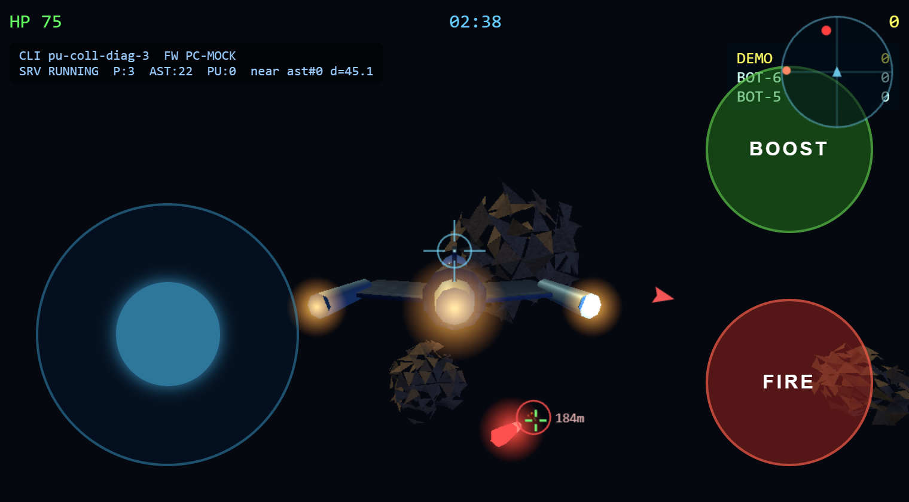
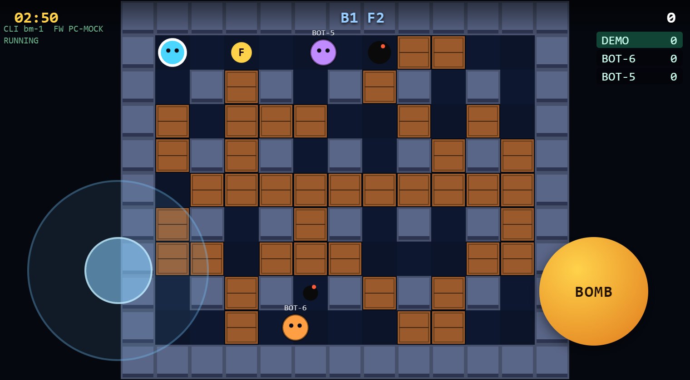
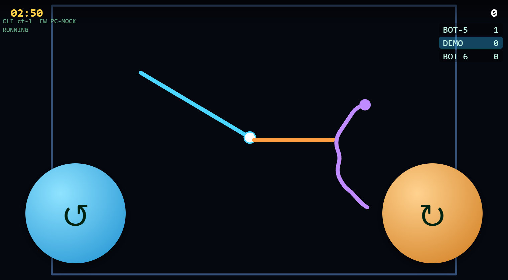
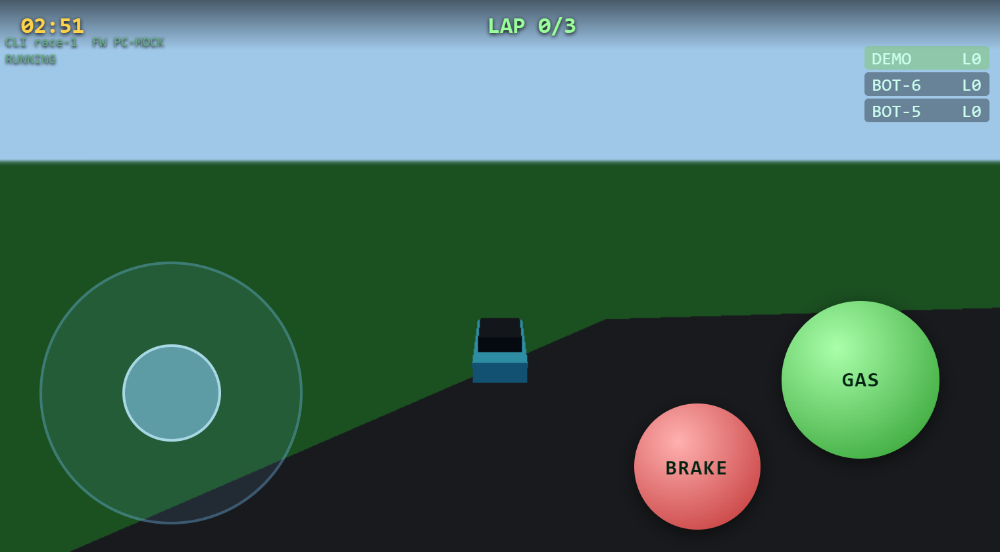
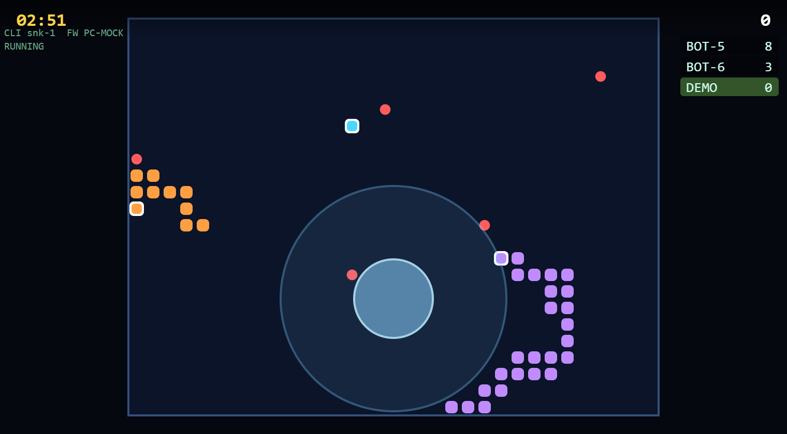
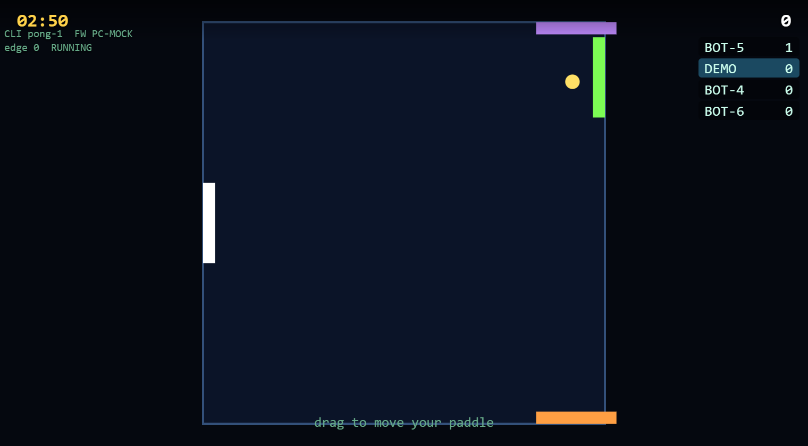

# PocketWebGames

A pocket-sized **local multiplayer game console** hosted by an **M5Stack
Core2**. The Core2 opens its own Wi-Fi access point, serves the games over
HTTP, and runs the match server. Players join with their phones or tablets,
open a URL in the browser, and play together in the same room — no internet,
no app install.

The Core2 is the **host**: a launcher on its touchscreen lets you pick which
game to run; the chosen game shows its lobby and a join QR code. Exactly one
game runs at a time.

```text
Phone 1        Phone 2        Phone 3        Phone 4
Browser        Browser        Browser        Browser
   |              |              |              |
   +----------- WebSocket over Wi-Fi ----------+
                        |
                  M5Stack Core2
        Wi-Fi AP + Web server + Game server + Launcher
```

## Games

| Game | Style | Players | Win condition |
|------|-------|---------|---------------|
| **Space Dogfight** | 3D space shooter (Three.js) | 2–6 | Most kills in 3 min |
| **Blaster** | 2D grid, bombs + power-ups | 2–6 | Most kills in 3 min |
| **Trails** | Steer-only light-trails | 2–6 | Most mini-rounds survived in 3 min |
| **3D Racing** | Lap racing (Three.js) | 2–6 | First to 3 laps (or most by 3 min) |
| **Snake Arena** | Multiplayer snake | 2–6 | Most food in 3 min |
| **Bounce** | 4-edge paddle / air-hockey | 1–4 | Highest score in 3 min |

Each game lives in its own folder under `data/<slug>/` and shares one copy of
Three.js from `data/shared/`.

## Screenshots

(Captured from the PC mock with bot opponents — see
[tools/screenshot_games.py](tools/screenshot_games.py).)

| Space Dogfight | Blaster |
|:--:|:--:|
|  |  |
| **Trails** | **3D Racing** |
|  |  |
| **Snake Arena** | **Bounce** |
|  |  |

## Hardware

- M5Stack Core2 (ESP32-D0WDQ6-V3, 16 MB Flash, 8 MB PSRAM, touch display,
  speaker, vibration motor, IMU, microSD slot).
- Any phone or tablet with a recent browser (WebGL + WebSockets).
- No local Wi-Fi needed — the Core2 is its own access point.

## Software stack

- [PlatformIO](https://platformio.org/) + Arduino framework for ESP32.
- Libraries: `M5Core2`, `WiFi` (SoftAP), `AsyncTCP` + `ESPAsyncWebServer`
  (HTTP + WebSocket), `ArduinoJson`, `LittleFS` (web assets).
- Browser side: HTML + JavaScript; Three.js for the 3D games.

## Connecting

When the Core2 is running:

```text
SSID:     PocketWebGames
Password: pocketgames
URL:      http://192.168.4.1
```

The host picks a game from the launcher on the Core2 touchscreen; that game's
lobby and join QR appear. Each player joins the Wi-Fi, opens the URL (which
loads the active game), enters a name, and the round starts when the host
presses **Start** on the Core2. Tapping **MENU** in the game header returns to
the launcher.

## Build and flash

```text
pio run                    # build firmware
pio run --target upload    # flash to the Core2
pio run --target uploadfs  # upload web assets in /data to LittleFS
pio device monitor         # serial monitor
```

`platformio.ini` is configured for the `m5stack-core2` board.

## Testing on PC (no hardware)

You can play and test the browser games on a PC without an M5Stack Core2.
[`mock_server.py`](mock_server.py) stands in for the Core2: it serves the web
assets and speaks the same WebSocket protocol, with bot opponents to play
against. It hosts one game per process, chosen on the command line:

```text
uv run mock_server.py              # dogfight (default)
uv run mock_server.py blaster
uv run mock_server.py trails
uv run mock_server.py racing
uv run mock_server.py snake
uv run mock_server.py bounce
```

Then open http://localhost:8080 (it redirects to the active game).

PC controls:
- **Space Dogfight** — arrow keys steer, Space fires, left Shift boosts.
- **Blaster** — arrow keys / WASD move, Space drops a bomb.
- **Trails** — Left/Right arrows (or A/D) steer.
- **3D Racing** — arrow keys / WASD: up = gas, down = brake, left/right steer.
- **Snake Arena** — arrow keys / WASD change direction.
- **Bounce** — drag, or arrow keys, to move your paddle.

The mock uses only the Python standard library (no install needed) and
deliberately implements just enough of each game's rules to exercise the
client. The authoritative logic lives in the C++ firmware.

## Project layout

```text
PocketWebGames/
  platformio.ini      PlatformIO config (board = m5stack-core2)
  src/                Firmware
    main.cpp          setup/loop
    Host.{h,cpp}      Game registry + launcher (one active game)
    IGame.h           Interface every game implements
    Net.cpp           Wi-Fi AP, HTTP/WebSocket server, captive portal
    UI.cpp            Host display (launcher + shared draw helpers)
    DogfightGame.*    Space Dogfight
    BombermanGame.*   Blaster
    CurveFeverGame.*  Trails
    RacingGame.*      3D Racing
    SnakeGame.*       Snake Arena
    PongGame.*        Bounce
  include/            Firmware headers
  data/               Web assets served from LittleFS
    shared/           three.min.js.gz (shared by every game)
    dogfight/ blaster/ trails/ racing/ snake/ bounce/
  test/               Unit tests
  mock_server.py      PC mock of the Core2 for testing without hardware
  README.md           This file
  architecture.md     Architecture & protocol reference
  Agents.md           Guidance for AI coding agents on this repo
```

## Adding a game

See [Agents.md](Agents.md) for the checklist. In short: implement `IGame`,
register it in `Host::begin()`, add `data/<slug>/`, and add a sim to
`mock_server.py` so it can be tested on PC.

## Status

Six games run; firmware and LittleFS image build. Verified on the PC mock; a
hands-on hardware play-test of each game is still pending.

## License

PocketWebGames is released under the **MIT License** (see [LICENSE](LICENSE)).
Third-party dependencies and their licenses are listed in
[THIRD_PARTY_NOTICES.md](THIRD_PARTY_NOTICES.md). Note that `AsyncTCP` and
`ESPAsyncWebServer` are LGPL-3.0 — keeping this project open source satisfies
their relinking requirement.
